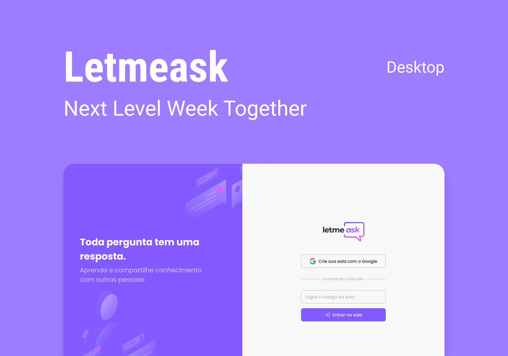

<div align="center">
<a href=#"></a>

<br /><br />

<div style="font-weight: 300; margin-top: 30px">
<a href="#"></a>
</div>
</div>
<div align="center">This project is created from the <strong>NLW#06</strong> of <strong>React</strong>.</div>

<br />
<div align="center">
  	<a href="#">
  		
	</a>
  	<a href="#">
  		
	</a>
	<a href="#">
		
	</a>
	<a href="#">
		
	</a>
	<a href="https://github.com/TutoDS/nlw06-react/stargazers">
    	
	</a>
</div>

<br />
<br />

<h2 style="font-weight:300">🌐 Deploy:</h2>

<a href="https://letmeask-cc61e.web.app/">
  
</a>

<br />
<br />

<h2 style="font-weight:300">💬 Changes</h2>

-   I'm using **Styled Components** instead **Sass**;
-   Use **Prettier** and **Husky Hooks**;
-   In **Home** and **New Room** page, I reuse the layout creating another component with shared layout (`AuthLayout`):
    -   This way the **Home** and **New Room** only contains de form and logo;
-   I'm created a Not Found page to error 404;
-   Add `modifier` prop to `Button` and `IconButton` component;
-   Add `react-hot-toast` to show error and success messages;
-   Add `react-icons` to add icons in `SVG` instead using `img` tag;

<br />
<br />

<h2 style="font-weight:300">How to fix <strong>Husky</strong> to run hooks:</h2>

In `package.json` add on scripts:

```json
"postinstall": "husky install",
```

After that run on your terminal:

-   **With Yarn:**
    -   `yarn husky add .husky/pre-commit "yarn lint-staged"`
-   **With NPM:**
    -   `npx husky add .husky/pre-commit "npm lint-staged`

<br /><br />

<div align="right" style="margin-top: 50px">
<h3 style="font-weight: 300">
🧑🏻‍💻 About Me
</h3>

<a href="https://github.com/TutoDS" alt="TutoDS">

<br />
 <sub><b>Daniel Sousa @TutoDS</b></sub>
</a>

<div style="margin: 20px 0" />

<a href="https://github.com/TutoDS">
      
</a>
<a href="https://www.linkedin.com/in/daniel-sousa-tutods/">
      
</a>
<a href="https://twitter.com/tutods/">
      
</a>
<a href="https://facebook.com/tutods2014">
      
</a>
<br />

<a href="https://youtube.com/tutods2014">
      
</a>
<a href="https://instagram.com/tutods2014">
      
</a>
<a href="https://gitlab.com/jdaniel.asousa">
      
</a>
<a href="https://app.rocketseat.com.br/me/tutods14">
      
</a>

</div>
